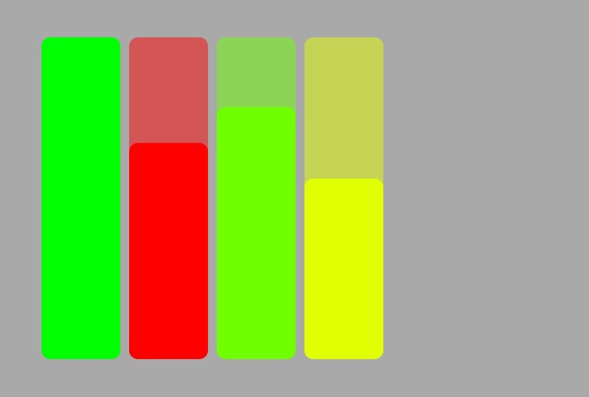

# AudioBallast
Adjust volume levels on Windows

## TODO
This project is currently a work in progress

A list of things to be implemented:
* Ability to mute audio sessions (button?)
* Names/icons to distinguish between audio sessions 
* Add master volume control

## Building
Please build using Visual Studio, as this project makes use of VS specific keywords
